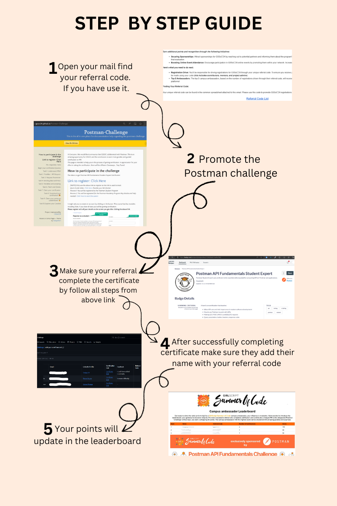

# Step by Step Guide



## 1. Open your mail and find your referral code.
- Your referral code can be found in the common spreadsheet attached to the email.
- If you are unable to find it, you can check your referral code [Here](https://docs.google.com/spreadsheets/d/1N8u--oq2ZOdR_7x1_lj-CdddRRMJCzek7BRVhzKY4AY/edit?usp=sharing).

## 2. Promote the Postman Challenge
- Share the challenge with your peers and network.
- You can use social media or your own approach to get more participants to the Postman Challenge.

## 3. Ensure your referrals complete the certificate
- Guide them to follow all steps from the provided link: [Postman Challenge Instructions](https://gssoc24.github.io/Postman-Challenge/)

## 4. After successful completion, ask them to add their name with your referral code
- Make sure they follow all steps in this link: [Click Here](https://gssoc24.github.io/Postman-Challenge/). It won't take more than 30-40 minutes.

## 5. Your points will update on the leaderboard
- Check the leaderboard at [CA Leaderboard](https://ca-leaderboard.vercel.app)

---

# Attention Campus Ambassadors!

## We have some exciting rewards for you as part of our CA campaign:

- **Earn 50 points for each completed certificate.**
- **Special Offer**: Bring in 50 participants to complete the Postman Challenge and receive:
  - An Amazon voucher
  - A VIP pass for the Web3 Conference
  - A GSSoC T-shirt
- **Raise Awareness**: Create social media posts or videos about the campaign and earn 50 points for each post.

## Important Links
- [Postman Challenge](https://swiy.co/postman)
- [Documentation](https://gssoc24.github.io/Postman-Challenge/)
- [GSSoC Postman Challenge Live](https://gssoc.substack.com/p/gssoc-postman-challenge-live)

Let’s make this a huge success! 🌟

## Hashtags
When posting on social media, please use the following hashtags:
- `#getpostman`
- `#girlscriptsoc`
- `#PostmanStudent`
- `#GSSoC24`

The referral codes have already been allotted to you at the start of the program. If you have any questions or need further assistance, please don’t hesitate to reach out.

---

# Perks for Participants of the Postman Challenge

## Upon completion:
- **Make sure you create a LinkedIn post and share the link to us by PR here**: [🔗Link to Repo](https://github.com/GSSoC24/Postman-Challenge)
- We will let you know by mail if you are a winner in the Postman giveaway.
- Any doubts and help needed: [Click Here to Start Discussion](https://github.com/GSSoC24/Postman-Challenge/discussions/categories/q-a)
- You can also upload your goodies with your photos here, once you get yours.
  


---

# How to Get Started
As a selected candidate, you’ll have the opportunity to:
- Promote GSSoC’24 on your campus and encourage your peers to participate.
- Network with other GSSoC’24 enthusiasts and industry professionals.
- Gain valuable experience in event management, marketing, and leadership.

## Earn Additional Points and Recognition
You can earn additional points and recognition through the following initiatives:
- **Securing Sponsorships**: Attract sponsorships for GSSoC’24 by reaching out to potential partners and informing them about the program’s benefits. This demonstrates initiative and will be considered in your final evaluation.
- **Boosting Online Event Attendance**: Encourage participation in GSSoC’24 online events by promoting them within your network. Increased audience engagement will positively impact your standing.

## Here’s What You Need to Do Next
- **Registration Drive**: You’ll be responsible for driving registrations for GSSoC’24 through your unique referral code. To ensure you receive your certificate of participation, a minimum of 200 registrations must be made using your code (this includes contributors, mentors, and project admins).
- **Top 5 Ambassadors**: The top 5 campus ambassadors, based on the number of registrations driven through their referral code, will receive exclusive GSSoC’24 swag and a public shout-out across our platforms!

## Finding Your Referral Code
Your unique referral code can be found in the common spreadsheet attached to this email. Please use this code to promote GSSoC’24 registrations among your peers.

### [Referral Code List](https://docs.google.com/spreadsheets/d/1N8u--oq2ZOdR_7x1_lj-CdddRRMJCzek7BRVhzKY4AY/edit?usp=sharing)

---

# Additional Resources
- [Quick Guide Video](https://www.loom.com/share/07cbe164e91a40c5aefbb831681923cc?sid=8a39732c-820b-4237-b763-8d15a0c18e6b)
- [Any doubts and help needed: Click Here to Start Discussion](https://github.com/GSSoC24/Postman-Challenge/discussions/categories/q-a)

```
Awesome, being in GSSoC you now earned an API certification within 25 minutes. This is great news and it will help your career for sure, don't forget to add it to your resume.
```